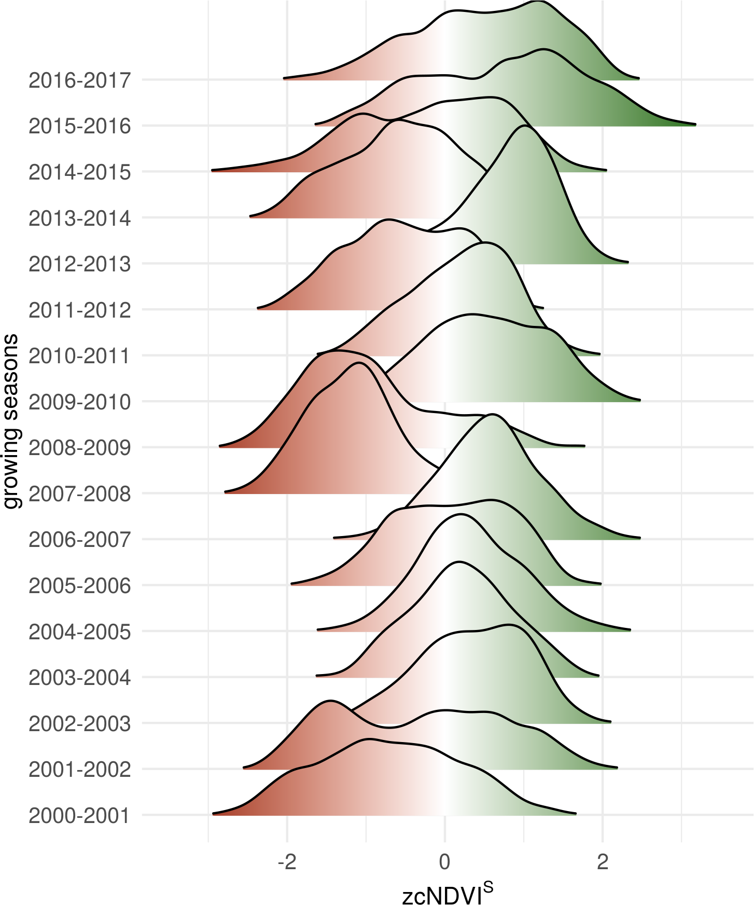

```{r setup, include=FALSE}
library(package = flexdashboard)
library(package = tidyverse)
library(anicon)

# Setup knitr
knitr::opts_chunk$set(
  echo = FALSE, message = FALSE, warning = FALSE,
  # Save all figures in the output dir, you have to include them explicitly
  # with an  tag
  fig.path = "../output/img/", fig.show = "hide"
)
```

## Row 1 {data-height=18}

###


<table style="width:100%">
<tr>
  <td rowspan="2">
  </img>
  </img>
  </img>
  </img>
  </td>
  <td><center><h3>
  **Prediction of agricultural drought in Chile from multiple spatio-temporal data sources**
  </h3></center></td>
  <td rowspan="2">
  </img>
  </img>
  </td>
</tr>
<tr>
  <td><center><a
  title="Universidad Mayor"
  href="mailto:francisco.zambrano@umayor.cl?Subject=Poster%20subject"
  target="_top">
  Francisco Zambrano¹,
  </a><a
  title="Universidad del Valle de Guatemala"
  href="mailto:odeleon@ces.uvg.edu.gt?Subject=Poster%20subject"
  target="_top">
  Anton Vrieling²,
  </a>
  <a
  title="Universidad del Valle de Guatemala"
  href="mailto:odeleon@ces.uvg.edu.gt?Subject=Poster%20subject"
  target="_top">
  Andy Nelson²,
  </a><a
  title="Universidad del Valle de Guatemala"
  href="mailto:odeleon@ces.uvg.edu.gt?Subject=Poster%20subject"
  target="_top">
  Michele Meroni³,
  </a><a
  title="Universidad del Valle de Guatemala"
  href="mailto:odeleon@ces.uvg.edu.gt?Subject=Poster%20subject"
  target="_top">
  Tsegaye Tadesse⁴
  </a></br></br>
  </center>
  </td>
</tr>
</table> 

<hr>

**Motivation:** Although there is debate whether drought frequency has increased in recent years (Dai, 2012;), climate change is expected to exacerbate the phenomenon and lead to more frequent and intense drought periods, which may even occur in regions where overall precipitation increases are expected (IPCC, 2013). Planning for effective adaptation strategies is thus crucial to mitigate future impacts (Roco et al., 2014). In addition, the ability to anticipate the impact of drought early in the season and take in-season mitigation measures such as more targeted irrigation, or reducing stand density (Bodner et al., 2015) could help to reduce crop losses (Pulwarty and Sivakumar, 2014).  
**Goal:** The main goal of this study is to assess if interannual variability in crop biomass productivity can be accurately predicted using freely-available, near real-time data sources. 

## Row 2 {data-height=100}

### **Methods** {data-width=28}


#### Study area: main agricultural land of Chile

</img>

#### Workflow: for predictions at 1 to 6 months lead times

</img>

#### Proxy for crop biomass productivity

$$
zcNDVI^S=\frac{cNDVI^S-\overline{cNDVI^S}}{\sigma(cNDVI^S)}
$$
the standardized anomaly of cumulative NDVI over the growing season

### **Results** {data-width=36}

#### Proxy for seasonal crop biomass productivity

Growing season       |  Proxy for crop biomass
:-------------------------:|:-------------------------:
</img>  |  </img>


#### Cross-validated accuracy measures

Overall          |  Four units
:-------------------------:|:-------------------------:
</img>  |  </img>

#### Accuracies vs. length of growing season for 1 (a) to 6 (f) lead times

<center>
</img>
</center>

### {data-width=36 data-height=40}

#### Discussion

1. Spatially explicit crop calendar information for Chile would better define this seasonality, allowing for better proxies of agricultural productivity, and more relevant timing of drought prediction

2. Although $zcNDVI$ at lead times was in general the best predictor of seasonal $zcNDVI$, the prediction accuracy strongly depended on the prediction lead time for both OLR and DL with poor predictive power early during the season.

3. Our study shows that complex global models do not always yield better results than simple models that carefully select the best predictors on a case-by-case basis.

4. Our current results are encouraging given that they reach similar or better accuracy compared to existing studies.


#### Future outlook {data-width=36 data-height=40}

1. Additional spatio-temporal predictors such as soil moisture, evapotranspiration, and existing multi-scalar drought indices can be incorporated into future implementation of both OLR and DL approaches.

2. While a few challenges remain, we believe that the models presented in this study can constitute a solid basis for improved operational drought warnings.

#### Acknowledgements

Work funded by CONICYT, Chile Scholarship/National Ph.D. 21141028. Additional funding was provided by the Hémera Centro de Observación de la Tierra from the Universidad Mayor, Chile.

#### Contact information

<span><i class="fas  fa-envelope-square fa-10x faa-flash animated " style=" color:blue;"></i></span> francisco.zambrano@umayor.cl   
<span><i class="fab  fa-researchgate fa-10x faa-flash animated " style=" color:blue;"></i></span>www.researchgate.net/profile/Francisco_Zambrano_Bigiarini  
<span><i class="fab  fa-linkedin fa-10x faa-flash animated " style=" color:blue;"></i></span> www.linkedin.com/in/frzambra   
<span><i class="fab  fa-twitter fa-10x faa-flash animated " style=" color:blue;"></i></span>  www.twitter.com/in/frzambra  
<span><i class="fas  fa-link fa-10x faa-flash animated " style=" color:blue;"></i></span>https://hemera.umayor.cl/


**References** 

Dai, A. (2012). Increasing drought under global warming in observations and models. Nature Climate Change, 3(1), 52–58. https://doi.org/10.1038/nclimate1633  
Vrieling, A., Meroni, M., Mude, A. G., Chantarat, S., Ummenhofer, C. C., & de Bie, K. (2016). Early assessment of seasonal forage availability for mitigating the impact of drought on {E}ast {A}frican pastoralist. Remote Sensing of Environment, 174, 44–55.  
Zambrano, F., Vrieling, A., Nelson, A., Meroni, M., & Tadesse, T. (2018). Prediction of drought-induced reduction of agricultural productivity in Chile from MODIS, rainfall estimates, and climate oscillation indices. Remote Sensing of Environment, 219, 15–30. https://doi.org/10.1016/J.RSE.2018.10.006
<!-- </font size> -->
<!-- ## Row 3 {data-height=10}  -->

<!-- ### **Fig. 2: Place the volcano figure where you please.** {data-width=50} -->

<!-- </img> -->


